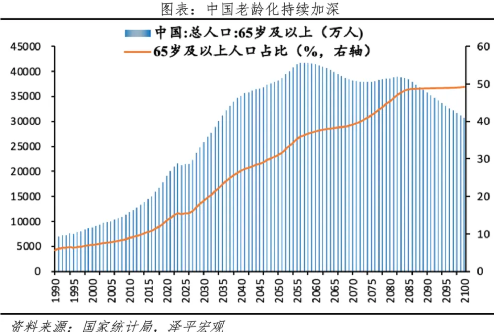
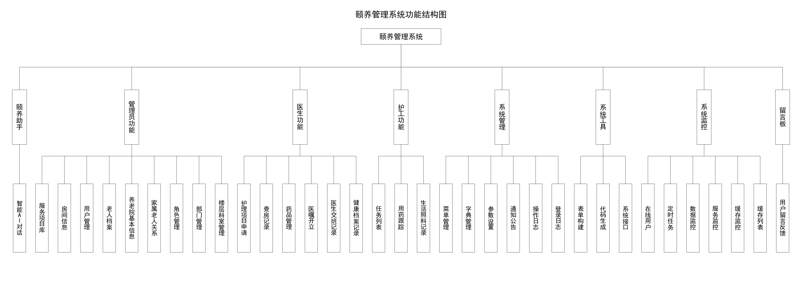
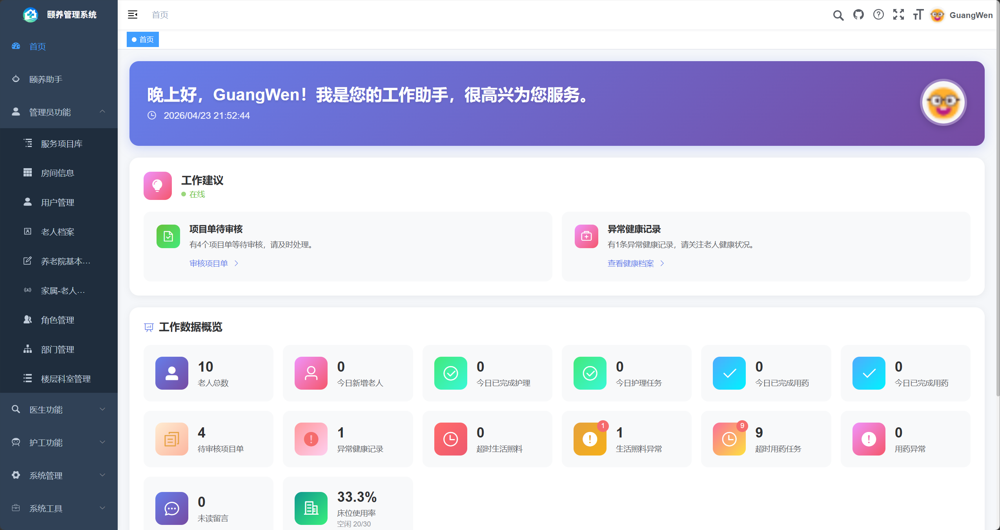
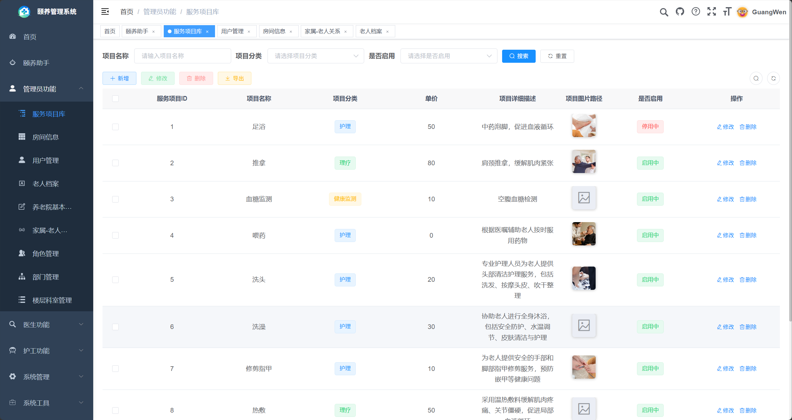
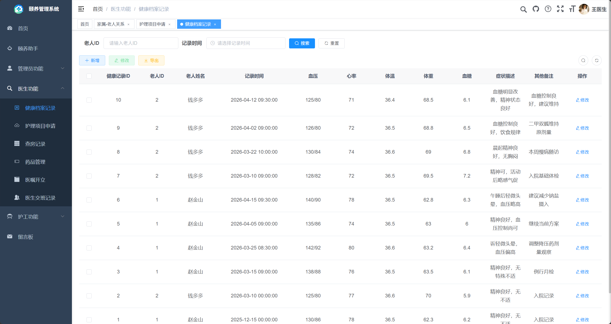
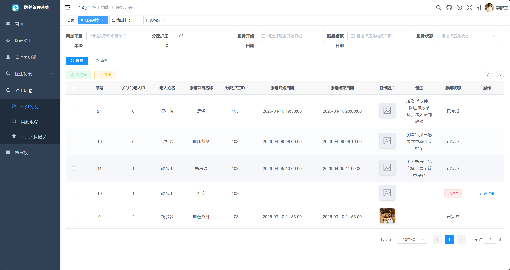
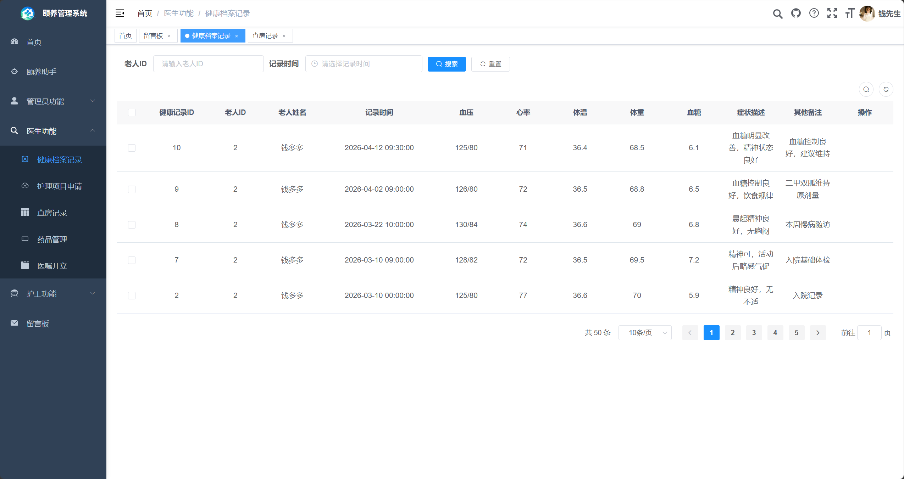
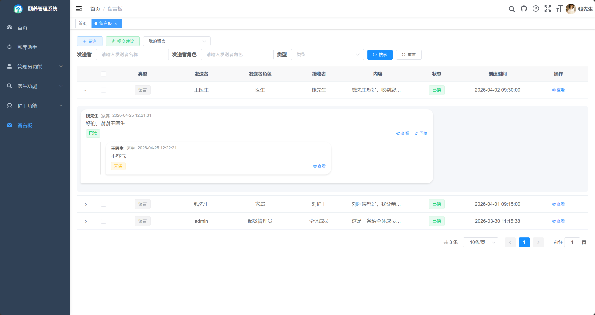
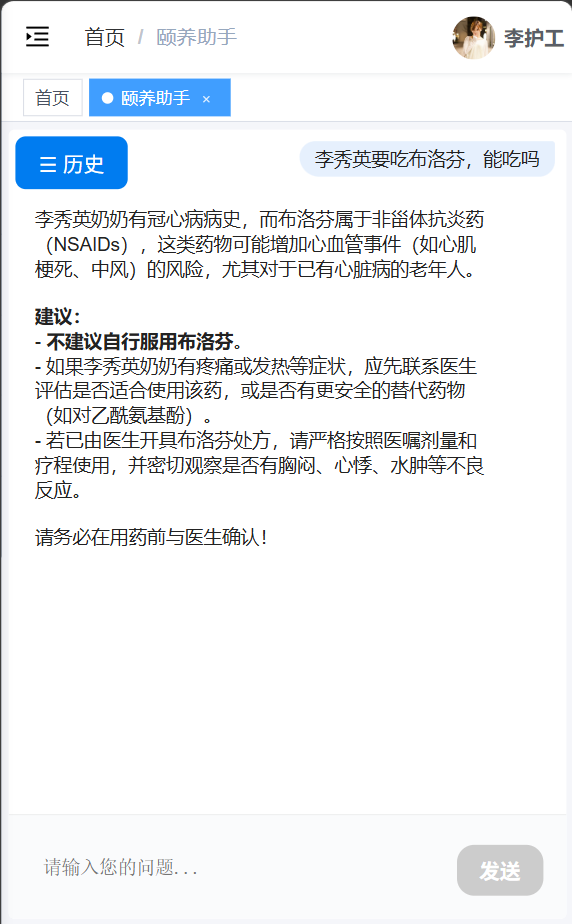
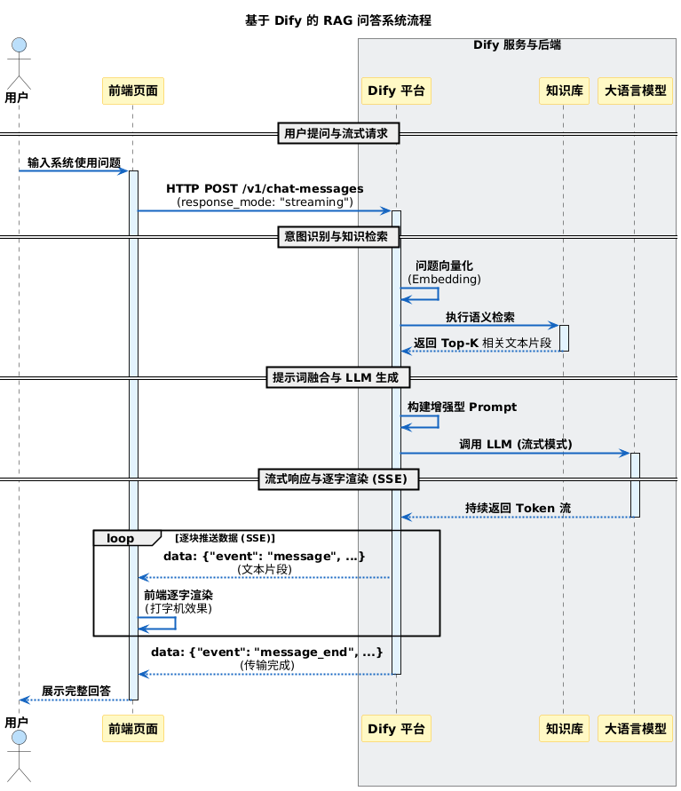

# 颐养管理系统

> **说明**：本项目为本科毕业设计作品，基于 [RuoYi](https://gitee.com/y_project/RuoYi-Vue) 前后端分离框架二次开发。系统整体业务逻辑（用户管理、角色权限、菜单管理、字典管理、定时任务、代码生成等）大量复用了若依的原生代码，在此基础上针对医养结合场景新增了老人档案、健康记录、护工任务、AI 问答等模块。作为毕业设计，代码在工程规范性和细节处理上仍有不足，但核心业务流程完整，能够满足毕业答辩的要求。答辩时的重点在于**讲清楚系统的设计思路和业务流程**，而非逐行讲解代码实现。

一款面向智慧医养结合服务中心的综合管理平台，深度融合"医"与"养"两大核心服务，通过数字化手段实现养老服务的标准化、精细化和智能化管理。

系统基于 [RuoYi](https://gitee.com/y_project/RuoYi-Vue) 前后端分离框架二次开发，后端采用 Spring Boot + MyBatis，前端采用 Vue 2 + Element UI，并集成基于 Dify 的 RAG 智能问答助手。

## 背景

随着我国老龄化程度持续加深，养老机构对"医养结合"服务的需求日益增长。本系统旨在解决传统养老服务中信息不透明、服务难追溯、多方协同效率低等问题。



## 核心特色

- **医养融合**：将医疗护理与生活照料有机结合，为老人提供全方位的健康保障
- **服务监管**：所有服务过程可追溯、可监管，确保服务质量
- **角色协同**：管理员、医生、护工、家属多方协同，形成完整的服务闭环
- **智能高效**：自动化的任务分配、超时检测和异常上报机制，提升运营效率
- **AI 助手**：集成基于 Dify 的 RAG 智能问答，按角色提供个性化解答

## 使用角色

| 角色 | 主要职责 |
|------|----------|
| 超级管理员 | 系统最高权限，全局配置和管理 |
| 管理员 | 用户权限、老人档案、服务项目、房间设施、组织架构管理 |
| 医生 | 健康档案、医嘱开立、健康评估、医疗交接班 |
| 护工 | 生活照料、用药跟踪、服务项目打卡、异常上报 |
| 家属 | 查看老人档案与健康记录、留言沟通 |

## 功能结构



## 系统界面

### 工作台首页

首页聚合工作建议与数据概览，待审核项目、异常健康记录、超时任务等一目了然。



### 服务项目库

管理员可维护足浴、推拿、血糖监测、喂药、洗头等服务项目，支持分类、定价与启用/停用。



### 健康档案记录

医生为老人记录血压、心率、体温、体重、血糖及症状描述，形成连续的健康档案。



### 护工任务列表

护工查看分配到的服务项目任务，支持打卡、上传打卡图片、记录备注，超时任务自动标记。



### 家属视图

家属可查看关联老人的健康档案记录，了解老人健康状况。



### 留言板

医生、护工、家属之间可留言沟通，支持按角色发送与回复。



### 颐养助手（AI 问答）

基于 Dify 的 RAG 智能问答助手，按角色（管理员/医生/护工/家属）提供个性化解答，支持查询老人档案、用药建议、操作指引等。



## AI 助手技术流程

AI 助手采用 RAG（检索增强生成）架构：用户提问经向量化后在知识库中做语义检索，检索结果与提示词融合后交由大语言模型流式生成，前端通过 SSE 逐字渲染。



## 系统与 Dify 的协作方式

本系统的 AI 智能助手并非简单的"套壳聊天"，而是通过 **Dify 平台** 作为中间层，实现了业务系统与 AI 能力的深度协作。整体架构如下：

```
┌──────────┐     ┌──────────────┐     ┌──────────────┐     ┌──────────────┐
│  Vue 前端 │ ──▶ │  Spring Boot  │ ─▶ │  Dify 平台    │ ──▶ │  大语言模型   │
│  (SSE)   │ ◀── │  后端 API     │ ◀── │  (RAG+工具)   │ ◀── │  (Qwen等)    │
└──────────┘     └──────────────┘     ──────────────┘     └──────────────┘
                                            │
                                            ▼
                                    ┌──────────────┐
                                    │  系统 REST API │
                                    │ (查询老人/健康  │
                                    │  档案/知识库)   │
                                    └──────────────┘
```

### 协作流程

1. **前端发起请求**：用户在"颐养助手"页面输入问题，前端通过 SSE（Server-Sent Events）将请求发送到后端 `/ai/chat` 接口，携带当前登录用户的 JWT Token 和角色信息。

2. **后端转发到 Dify**：后端 `DifyServeController` 将用户问题、角色信息（管理员/医生/护工/家属）转发到 Dify 的 `/v1/chat-messages` API，使用流式响应模式（`response_mode: "streaming"`）。

3. **Dify 智能处理**：Dify Agent 同时执行两条路径：
   - **知识库检索（RAG）**：将问题向量化后，在系统介绍 Q&A 知识库中做语义检索，找到最相关的文档片段
   - **工具调用（Function Calling）**：根据问题意图，自动调用系统暴露的 REST API 工具，例如：
     - `通过名字查询老人档案` → 调用系统 `/elder/search` 接口
     - `通过id查询老人健康档案` → 调用系统 `/healthRecord/record` 接口
     - `通过id查询用药跟踪记录` → 调用系统 `/medicationRecord` 接口
     - `获取当前时间` → 内置工具

4. **结果融合与生成**：Dify 将知识库检索结果、API 返回的业务数据、系统提示词（含角色设定）融合后，交由大语言模型生成最终回答，通过 SSE 流式返回给前端。

5. **前端逐字渲染**：前端收到 SSE 数据流后逐字渲染，实现"打字机"效果。

### 角色适配

Dify 的提示词中预设了角色适配逻辑，同一问题会根据用户角色给出不同回答：
- **管理员**：侧重管理建议、系统操作指引
- **医生**：侧重医疗专业建议、健康数据分析
- **护工**：侧重护理操作指导、任务执行建议
- **家属**：用通俗语言解释，侧重老人状况说明

### Dify 工作流配置


在 Dify 平台中，Agent 配置了 6 个工具（Function），每个工具对应后端的一个 REST API。Dify 通过 HTTP 请求调用这些接口，获取实时业务数据后融入回答中。

## 技术栈

**后端**

- Spring Boot 2.5.15
- Spring Security + JWT 认证
- MyBatis + PageHelper
- Druid 数据源
- MySQL 8.0
- Redis

**前端**

- Vue 2 + Vue CLI
- Element UI
- Axios
- ECharts

**AI**

- Dify（RAG 智能问答）

## 项目结构

```
YiYang
├── yiyang-admin        # 后端启动模块（Web 入口、控制器）
├── yiyang-common       # 通用工具与基础类
├── yiyang-framework    # 框架核心（安全、拦截器、数据源等）
├── yiyang-system       # 系统业务模块（用户、角色、菜单等）
├── yiyang-quartz       # 定时任务模块
├── yiyang-generator    # 代码生成模块
├── yiyang-ui           # 前端 Vue 工程
├── sql                 # 数据库脚本
└── docs                # 文档与系统截图
```

## 快速开始

### 环境要求

- JDK 8+
- Maven 3.x
- MySQL 8.0
- Redis
- Node.js（前端构建）

### 后端

1. 创建数据库并导入 `sql/sqlAll.sql`
2. 修改 `yiyang-admin/src/main/resources/application-druid.yml` 中的数据库连接（地址、用户名、密码）
3. 修改 `yiyang-admin/src/main/resources/application.yml` 中的 Redis 连接与 JWT 密钥
4. （可选）配置 Dify AI 的 `url` 与 `key`
5. 启动 `yiyang-admin` 模块，默认端口 `8081`

### 前端

```bash
cd yiyang-ui
npm install
npm run dev
```

## 说明

- 配置文件中涉及数据库密码、Redis 密码、JWT 密钥、Dify API Key 等敏感信息均已替换为占位符，部署时请自行填写。
- 本项目基于 RuoYi 框架（MIT License）二次开发。
