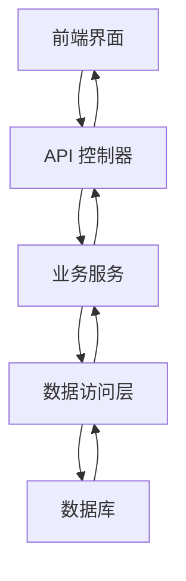
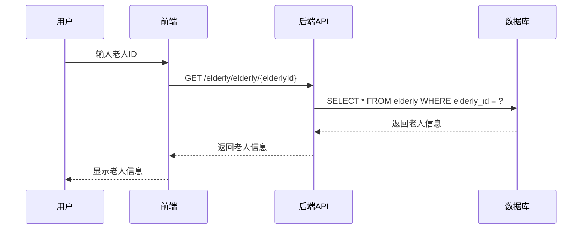
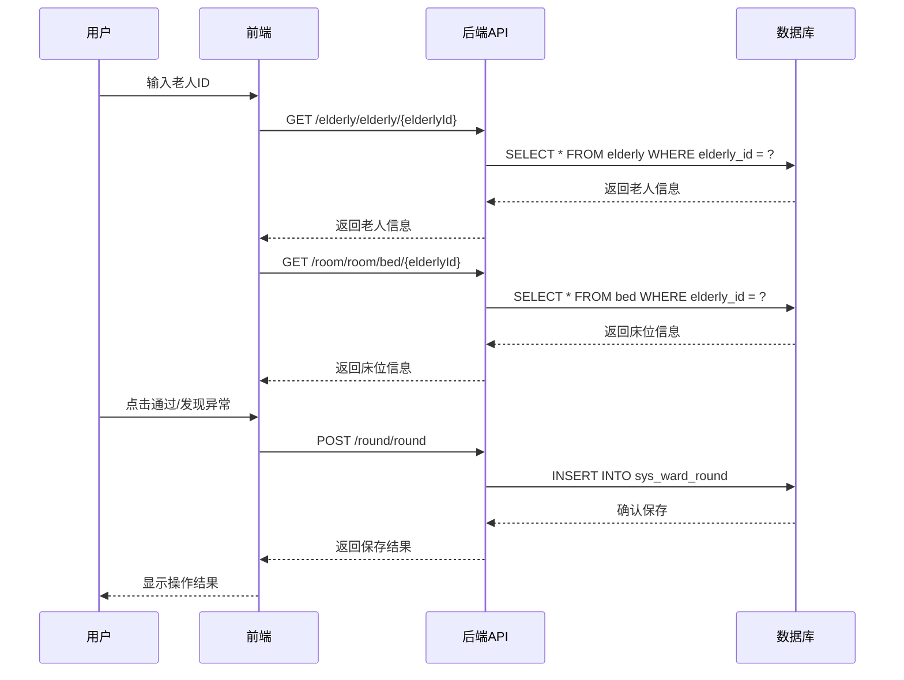
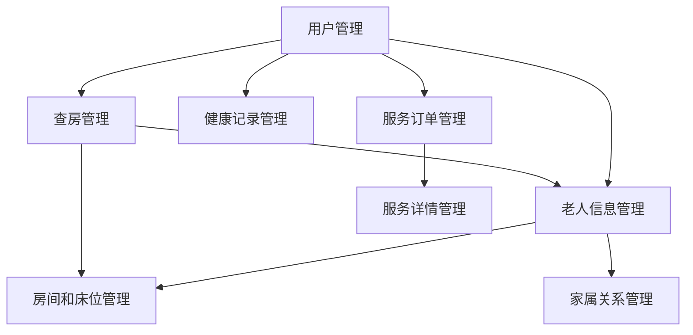

===
# 系统概述

## 系统简介

颐养管理系统是一个专为养老院设计的综合管理系统，旨在提高养老院的管理效率和服务质量。系统涵盖了老人信息管理、房间床位管理、服务订单管理、健康记录管理和查房管理等核心业务流程。

## 核心功能

### 1. 老人信息管理
- 老人基本信息录入和管理
- 老人性别、年龄等信息展示
- 老人与床位的关联管理

### 2. 房间和床位管理
- 房间信息管理
- 床位分配和管理
- 床位状态实时更新
- 显示每个床位的使用情况

### 3. 服务订单管理
- 服务项目管理
- 服务订单创建和审核
- 服务任务分配
- 服务完成状态跟踪
- 服务打卡和图片上传

### 4. 健康记录管理
- 老人健康数据记录
- 健康指标趋势分析
- 记录时间和记录人自动填充

### 5. 查房管理
- 老人信息快速查询
- 房间和床位信息自动填充
- 查房时间自动填充
- 查房状态管理（通过/异常）
- 异常情况描述和处理
- 查房图片上传

## 技术栈

### 前端技术
- Vue.js 2.x
- Element UI
- Axios
- Vuex

### 后端技术
- Spring Boot
- MyBatis
- Maven
- MySQL

### 其他技术
- Redis（缓存）
- Swagger（API文档）
- Docker（容器化）

## 系统特点

1. **用户友好**：界面简洁直观，操作流程清晰
2. **功能完善**：涵盖养老院核心业务流程
3. **数据安全**：严格的权限控制和数据加密
4. **可扩展性**：模块化设计，易于扩展新功能
5. **实时性**：数据实时更新，确保信息准确性
6. **移动友好**：支持移动端访问，方便护工现场操作

## 系统价值

- **提高管理效率**：自动化流程减少人工操作
- **提升服务质量**：规范服务流程，确保服务质量
- **增强监管能力**：实时监控和数据统计
- **改善老人体验**：提供更精准、及时的服务
- **降低运营成本**：优化资源配置，减少浪费
===
# 系统架构

## 技术架构

### 系统分层

颐养管理系统采用经典的三层架构设计：

1. **表现层（Presentation Layer）**
   - 前端：Vue.js + Element UI
   - 负责用户界面展示和用户交互
   - 处理表单提交、数据展示和页面跳转

2. **业务逻辑层（Business Logic Layer）**
   - 后端：Spring Boot 服务
   - 负责业务逻辑处理
   - 实现核心功能和业务规则
   - 协调各个服务之间的交互

3. **数据访问层（Data Access Layer）**
   - MyBatis ORM 框架
   - 负责与数据库的交互
   - 执行 SQL 操作
   - 处理数据的增删改查

4. **数据存储层（Data Storage Layer）**
   - MySQL 数据库
   - 存储系统数据
   - 保证数据的安全性和完整性

### 模块划分

系统按照功能划分为以下核心模块：

| 模块名称 | 主要功能 | 负责文件 |
|---------|---------|---------|
| 老人信息管理 | 老人基本信息管理 | elderly 模块 |
| 房间床位管理 | 房间和床位分配管理 | room 模块 |
| 服务订单管理 | 服务项目和订单管理 | projectOrder 模块 |
| 服务详情管理 | 服务执行和打卡管理 | detail 模块 |
| 健康记录管理 | 老人健康数据记录 | record 模块 |
| 查房管理 | 老人房间查房管理 | round 模块 |
| 用户管理 | 系统用户和权限管理 | system/user 模块 |
| 家属关系管理 | 老人家属关系管理 | familyElderly 模块 |
| 养老院信息管理 | 养老院基本信息管理 | information 模块 |

## 数据流程

### 系统整体数据流程



### 核心业务流程

#### 1. 老人信息管理流程



#### 2. 查房管理流程



## 技术特点

### 1. 前后端分离
- 前端使用 Vue.js 构建单页应用
- 后端提供 RESTful API 接口
- 前后端通过 HTTP 协议通信
- 提高开发效率和系统可维护性

### 2. 模块化设计
- 按功能划分为独立模块
- 模块之间通过接口通信
- 降低模块间耦合度
- 便于团队协作和代码维护

### 3. 数据安全
- 采用 Spring Security 进行权限控制
- 密码加密存储
- 接口访问权限验证
- 防止 SQL 注入和 XSS 攻击

### 4. 性能优化
- 使用 Redis 缓存热点数据
- 数据库索引优化
- 分页查询减少数据传输
- 异步处理耗时操作

### 5. 可扩展性
- 基于 Spring Boot 框架
- 支持微服务架构
- 模块化设计便于功能扩展
- 支持插件化开发

## 部署架构

### 开发环境
- 前端：Node.js + Vue CLI
- 后端：JDK 8+ + Maven
- 数据库：MySQL 5.7+

### 生产环境
- 前端：Nginx 静态文件服务器
- 后端：Tomcat 应用服务器
- 数据库：MySQL 5.7+ 主从复制
- 缓存：Redis 集群
- 负载均衡：Nginx

### 容器化部署
- 使用 Docker 容器化应用
- Docker Compose 管理多容器
- Kubernetes 集群管理（可选）
===

# 功能模块

## 模块概览

颐养管理系统包含以下核心功能模块：

1. 老人信息管理 - 管理老人基本信息
2. 房间和床位管理 - 管理房间和床位分配
3. 服务订单管理 - 管理服务订单和任务
4. 健康记录管理 - 管理老人健康数据
5. 查房管理 - 管理老人房间查房
6. 用户管理 - 管理系统用户和权限
7. 家属关系管理 - 管理老人家属关系
8. 养老院信息管理 - 管理养老院基本信息

## 模块间关系

各模块之间的关系如下：



## 模块依赖

| 模块 | 依赖模块 | 依赖关系 |
|------|---------|----------|
| 老人信息管理 | 用户管理 | 依赖用户权限 |
| 房间和床位管理 | 老人信息管理 | 老人与床位关联 |
| 服务订单管理 | 老人信息管理 | 服务对象为老人 |
| 服务订单管理 | 用户管理 | 服务提供者为护工 |
| 健康记录管理 | 老人信息管理 | 记录对象为老人 |
| 健康记录管理 | 用户管理 | 记录者为护工或管理员 |
| 查房管理 | 老人信息管理 | 查房对象为老人 |
| 查房管理 | 房间和床位管理 | 查房位置为房间床位 |
| 家属关系管理 | 老人信息管理 | 家属与老人关联 |
| 家属关系管理 | 用户管理 | 家属信息从用户系统获取 |

## 模块功能表

| 模块名称 | 主要功能 | 操作权限 |
|---------|---------|----------|
| 老人信息管理 | 老人信息增删改查 | 管理员、护工 |
| 房间和床位管理 | 房间床位分配管理 | 管理员 |
| 服务订单管理 | 服务订单创建审核 | 管理员 |
| 服务详情管理 | 服务执行和打卡 | 护工 |
| 健康记录管理 | 健康数据记录分析 | 护工、管理员 |
| 查房管理 | 房间查房和异常处理 | 护工、管理员 |
| 用户管理 | 用户账号和权限管理 | 管理员 |
| 家属关系管理 | 家属信息和关系管理 | 管理员 |
| 养老院信息管理 | 养老院基本信息管理 | 管理员 |

# 查房管理模块

## 功能概述

查房管理模块是颐养管理系统的核心功能之一，主要用于管理养老院的日常查房工作。该模块允许护工或管理员记录老人的房间状态，及时发现和处理异常情况。

## 核心功能

### 1. 老人信息快速查询
- 通过输入老人ID自动查询老人基本信息
- 显示老人姓名、性别等关键信息
- 减少手动输入错误

### 2. 房间和床位信息自动填充
- 根据老人ID自动查询并填充房间号和床位号
- 显示房间号和床位号的详细信息
- 确保查房记录的准确性

### 3. 查房时间自动填充
- 自动填充当前时间作为查房时间
- 支持手动修改查房时间
- 确保记录的及时性

### 4. 查房状态管理
- 提供"通过"和"发现异常"两个操作按钮
- 点击"通过"标记状态为1（正常）
- 点击"发现异常"标记状态为2（异常）
- 发现异常时强制要求填写异常描述

### 5. 异常情况处理
- 异常描述文本域，详细记录异常情况
- 处理措施文本域，记录针对异常的处理方法
- 确保异常情况得到及时处理和跟踪

### 6. 查房图片上传
- 支持上传查房现场图片
- 图片预览功能
- 为查房记录提供视觉证据

## 技术实现

### 前端实现

#### 核心文件
- `yiyang-ui/src/views/round/round/index.vue` - 查房管理页面

#### 关键功能实现

1. **老人信息查询**
```javascript
// 老人ID输入事件处理
handleElderlyIdInput() {
  const elderlyId = this.form.elderlyId
  if (elderlyId) {
    getElderly(elderlyId).then(response => {
      if (response.code === 200) {
        this.elderlyInfo = response.data
        // 根据老人ID查询对应的床位和房间信息
        getBedByElderlyId(elderlyId).then(bedResponse => {
          if (bedResponse.code === 200 && bedResponse.data) {
            this.form.bedId = bedResponse.data.bedId
            this.form.roomId = bedResponse.data.roomId
            this.bedInfo = bedResponse.data
            // 根据房间ID查询房间信息
            getRoom(bedResponse.data.roomId).then(roomResponse => {
              if (roomResponse.code === 200 && roomResponse.data) {
                this.roomInfo = roomResponse.data
              }
            })
          }
        })
      } else {
        this.elderlyInfo = null
      }
    })
  } else {
    this.elderlyInfo = null
  }
}
```

2. **查房时间自动填充**
```javascript
// 表单重置
reset() {
  // 获取当前时间，格式为yyyy-MM-dd HH:mm:ss
  const now = new Date()
  const year = now.getFullYear()
  const month = String(now.getMonth() + 1).padStart(2, '0')
  const day = String(now.getDate()).padStart(2, '0')
  const hours = String(now.getHours()).padStart(2, '0')
  const minutes = String(now.getMinutes()).padStart(2, '0')
  const seconds = String(now.getSeconds()).padStart(2, '0')
  const currentTime = `${year}-${month}-${day} ${hours}:${minutes}:${seconds}`

  this.form = {
    // ...
    roundTime: currentTime,
    // ...
  }
  // ...
}
```

3. **查房状态处理**
```javascript
// 通过按钮
handlePass() {
  this.form.status = 1
  this.submitForm()
}

// 发现异常按钮
handleAbnormal() {
  if (!this.form.abnormalDesc) {
    this.$modal.alert('请填写异常描述')
    return
  }
  this.form.status = 2
  this.submitForm()
}
```

4. **查房人ID自动填充**
```javascript
// 表单重置
reset() {
  // ...
  this.form = {
    // ...
    roundUserId: this.$store.getters.userId,
    // ...
  }
  // ...
}
```

### 后端实现

#### 核心文件
- `yiyang-admin/src/main/java/com/yiyang/round/controller/SysWardRoundController.java` - 查房记录控制器
- `yiyang-admin/src/main/java/com/yiyang/round/service/impl/SysWardRoundServiceImpl.java` - 查房记录服务实现
- `yiyang-admin/src/main/java/com/yiyang/room/controller/RoomController.java` - 房间控制器（提供床位查询接口）

#### 关键功能实现

1. **根据老人ID查询床位信息**
```java
// RoomController.java
/**
 * 根据老人ID查询床位信息
 */
@GetMapping("/bed/{elderlyId}")
public AjaxResult getBedByElderlyId(@PathVariable("elderlyId") Long elderlyId)
{
    return success(roomService.selectBedByElderlyId(elderlyId));
}
```

2. **床位查询服务实现**
```java
// RoomServiceImpl.java
/**
 * 根据老人ID查询床位信息
 * 
 * @param elderlyId 老人ID
 * @return 床位信息
 */
@Override
public Bed selectBedByElderlyId(Long elderlyId)
{
    return roomMapper.selectBedByElderlyId(elderlyId);
}
```

3. **床位查询SQL**
```xml
<!-- RoomMapper.xml -->
<select id="selectBedByElderlyId" parameterType="Long" resultMap="BedResult">
    select bed_id, room_id, bed_number, status, elderly_id, remark, create_by, create_time, update_by, update_time, del_flag
    from bed
    where elderly_id = #{elderlyId}
</select>
```

## 使用流程

### 1. 新增查房记录
1. 点击"新增"按钮打开查房记录表单
2. 输入老人ID，系统自动查询并显示老人信息
3. 系统自动填充房间号、床位号和当前时间
4. 填写查房相关信息
5. 根据查房结果点击"通过"或"发现异常"按钮
   - 点击"通过"：直接提交查房记录
   - 点击"发现异常"：填写异常描述后提交
6. 系统保存查房记录并显示成功提示

### 2. 修改查房记录
1. 选择要修改的查房记录，点击"修改"按钮
2. 系统自动填充原有记录信息
3. 修改相关信息
4. 点击"通过"或"发现异常"按钮提交修改
5. 系统更新查房记录并显示成功提示

### 3. 查询查房记录
1. 在查询条件中输入相关信息（如房间ID、老人ID等）
2. 点击"搜索"按钮
3. 系统显示符合条件的查房记录列表

### 4. 删除查房记录
1. 选择要删除的查房记录
2. 点击"删除"按钮
3. 确认删除操作
4. 系统删除查房记录并显示成功提示

## 常见问题

### 1. 输入老人ID后不显示老人信息
- **原因**：可能是老人ID不存在或网络连接问题
- **解决方法**：检查老人ID是否正确，或刷新页面重试

### 2. 房间号和床位号不自动填充
- **原因**：可能是该老人未分配床位
- **解决方法**：先为老人分配床位，再进行查房操作

### 3. 点击"发现异常"按钮提示"请填写异常描述"
- **原因**：系统要求发现异常时必须填写异常描述
- **解决方法**：填写异常描述后再点击"发现异常"按钮

### 4. 图片上传失败
- **原因**：可能是图片格式不正确或网络连接问题
- **解决方法**：检查图片格式是否为支持的格式（如JPG、PNG等），或刷新页面重试

## 最佳实践

1. **及时记录**：查房后及时记录，确保信息的准确性和及时性
2. **详细描述**：发现异常时，详细描述异常情况和处理措施
3. **上传图片**：对于重要的异常情况，上传现场图片作为证据
4. **定期检查**：定期检查查房记录，确保所有异常情况都得到处理
5. **权限管理**：根据角色分配相应的操作权限，确保系统安全

## 未来优化方向

1. **移动端适配**：开发移动端应用，方便护工在现场进行查房操作
2. **语音输入**：支持语音输入异常描述，提高操作效率
3. **智能预警**：基于历史数据，智能预警可能出现的异常情况
4. **数据分析**：分析查房数据，提供养老院管理决策支持
5. **集成监控**：与视频监控系统集成，实现远程查房
===

# 使用指南

## 系统登录

### 登录流程
1. 打开系统登录页面
2. 输入账号和密码
3. 点击"登录"按钮
4. 系统验证通过后进入主界面

### 登录信息
- **默认管理员账号**：admin
- **默认管理员密码**：admin123
- **默认护工账号**：nurse
- **默认护工密码**：nurse123

## 系统主界面

系统主界面包含以下部分：

1. **顶部导航栏**：显示系统名称、当前用户信息和退出按钮
2. **左侧菜单栏**：包含系统所有功能模块的导航菜单
3. **主内容区**：显示当前功能模块的具体内容
4. **底部状态栏**：显示系统版本信息和版权信息

## 功能模块使用指南

### 1. 老人信息管理

#### 功能说明
用于管理老人的基本信息，包括老人ID、姓名、性别、年龄等。

#### 操作流程
1. 点击左侧菜单"老人管理"进入老人信息管理页面
2. **新增老人**：点击"新增"按钮，填写老人基本信息，点击"确定"保存
3. **修改老人信息**：选择要修改的老人记录，点击"修改"按钮，修改信息后点击"确定"保存
4. **删除老人**：选择要删除的老人记录，点击"删除"按钮，确认后删除
5. **查询老人**：在查询条件中输入老人ID或姓名，点击"搜索"按钮

### 2. 房间和床位管理

#### 功能说明
用于管理养老院的房间和床位信息，包括房间号、楼层、容量和床位分配。

#### 操作流程
1. 点击左侧菜单"房间管理"进入房间和床位管理页面
2. **新增房间**：点击"新增"按钮，填写房间信息和床位数量，点击"确定"保存
3. **修改房间**：选择要修改的房间记录，点击"修改"按钮，修改信息后点击"确定"保存
4. **删除房间**：选择要删除的房间记录，点击"删除"按钮，确认后删除
5. **分配床位**：在房间详情中，为每个床位分配老人

### 3. 服务订单管理

#### 功能说明
用于管理服务订单的创建、审核和分配。

#### 操作流程
1. 点击左侧菜单"服务订单"进入服务订单管理页面
2. **创建订单**：点击"新增"按钮，选择服务项目、老人和护工，点击"确定"保存
3. **审核订单**：选择待审核的订单，点击"审核"按钮，选择审核结果
4. **分配任务**：审核通过后，系统自动为护工分配服务任务
5. **查看订单**：点击订单编号查看订单详情

### 4. 服务详情管理

#### 功能说明
用于护工执行服务和打卡。

#### 操作流程
1. 点击左侧菜单"服务详情"进入服务详情管理页面
2. **执行服务**：选择待执行的服务任务，点击"去打卡"按钮
3. **上传图片**：在打卡页面上传服务现场图片
4. **标记完成**：服务完成后，点击"标记为已完成"按钮
5. **报告问题**：如果服务过程中遇到问题，点击"标记为有问题"按钮并填写问题描述

### 5. 健康记录管理

#### 功能说明
用于记录和管理老人的健康数据。

#### 操作流程
1. 点击左侧菜单"健康记录"进入健康记录管理页面
2. **新增记录**：点击"新增"按钮，选择老人，填写健康数据，点击"确定"保存
3. **修改记录**：选择要修改的健康记录，点击"修改"按钮，修改信息后点击"确定"保存
4. **删除记录**：选择要删除的健康记录，点击"删除"按钮，确认后删除
5. **查询记录**：在查询条件中输入老人ID或日期，点击"搜索"按钮

### 6. 查房管理

#### 功能说明
用于记录和管理老人的房间查房情况。

#### 操作流程
1. 点击左侧菜单"查房管理"进入查房管理页面
2. **新增查房记录**：点击"新增"按钮，输入老人ID，系统自动填充相关信息，点击"通过"或"发现异常"按钮提交
3. **修改查房记录**：选择要修改的查房记录，点击"修改"按钮，修改信息后点击"通过"或"发现异常"按钮提交
4. **删除查房记录**：选择要删除的查房记录，点击"删除"按钮，确认后删除
5. **查询查房记录**：在查询条件中输入房间ID、老人ID或日期，点击"搜索"按钮

### 7. 用户管理

#### 功能说明
用于管理系统用户的账号和权限。

#### 操作流程
1. 点击左侧菜单"用户管理"进入用户管理页面
2. **新增用户**：点击"新增"按钮，填写用户信息和角色，点击"确定"保存
3. **修改用户**：选择要修改的用户记录，点击"修改"按钮，修改信息后点击"确定"保存
4. **删除用户**：选择要删除的用户记录，点击"删除"按钮，确认后删除
5. **重置密码**：选择用户记录，点击"重置密码"按钮，系统会生成新密码

### 8. 家属关系管理

#### 功能说明
用于管理老人与家属的关系信息。

#### 操作流程
1. 点击左侧菜单"家属关系"进入家属关系管理页面
2. **新增关系**：点击"新增"按钮，选择老人和家属，填写关系信息，点击"确定"保存
3. **修改关系**：选择要修改的关系记录，点击"修改"按钮，修改信息后点击"确定"保存
4. **删除关系**：选择要删除的关系记录，点击"删除"按钮，确认后删除
5. **查询关系**：在查询条件中输入老人ID或家属ID，点击"搜索"按钮

### 9. 养老院信息管理

#### 功能说明
用于管理养老院的基本信息。

#### 操作流程
1. 点击左侧菜单"养老院信息"进入养老院信息管理页面
2. **修改信息**：点击"修改"按钮，修改养老院信息，点击"确定"保存
3. **上传图片**：在修改页面上传养老院图片

## 系统操作技巧

### 1. 快捷键
- **Ctrl + F**：在当前页面搜索
- **Ctrl + N**：打开新标签页
- **Ctrl + W**：关闭当前标签页
- **Alt + Tab**：切换标签页

### 2. 数据导出
- 大部分列表页面都支持数据导出功能，点击"导出"按钮可以将数据导出为Excel格式
- 导出的数据可以用于离线分析或备份

### 3. 批量操作
- 大部分列表页面支持批量操作，选择多个记录后可以进行批量删除或其他操作
- 批量操作可以提高工作效率

### 4. 数据筛选
- 大部分列表页面支持高级筛选功能，点击"高级搜索"可以设置更多筛选条件
- 筛选结果可以保存为常用筛选条件

### 5. 分页导航
- 列表页面支持分页显示，点击页码可以跳转到对应页面
- 可以设置每页显示的记录数量

## 常见操作问题

### 1. 忘记密码
- **解决方法**：联系管理员重置密码

### 2. 无法上传图片
- **原因**：可能是图片格式不正确或文件过大
- **解决方法**：使用JPG、PNG格式的图片，文件大小不超过2MB

### 3. 页面加载缓慢
- **原因**：可能是网络连接问题或系统负载过高
- **解决方法**：检查网络连接，或在系统负载较低的时段操作

### 4. 操作权限不足
- **原因**：当前用户没有相应的操作权限
- **解决方法**：联系管理员分配相应的权限

### 5. 数据保存失败
- **原因**：可能是数据格式不正确或系统错误
- **解决方法**：检查数据格式是否正确，或刷新页面重试

## 系统维护

### 1. 定期备份
- 定期备份系统数据，防止数据丢失
- 备份频率建议为每天一次

### 2. 系统更新
- 定期更新系统版本，获取最新功能和安全补丁
- 更新前请备份数据

### 3. 日志管理
- 定期查看系统日志，及时发现和解决问题
- 日志文件位于系统安装目录的logs文件夹

### 4. 性能优化
- 定期清理系统缓存，提高系统性能
- 优化数据库索引，提高查询速度

### 5. 安全管理
- 定期更新用户密码
- 限制系统访问IP
- 启用HTTPS加密传输
===

# API文档

## API概述

颐养管理系统提供了一套完整的RESTful API接口，用于前端与后端之间的通信。这些接口涵盖了系统的所有功能模块，包括老人信息管理、房间床位管理、服务订单管理、健康记录管理和查房管理等。

## API基础信息

### 基础URL
- **开发环境**：http://localhost:8080
- **生产环境**：根据实际部署地址

### 请求格式
- **Content-Type**：application/json
- **请求方法**：GET、POST、PUT、DELETE

### 响应格式

所有API接口返回统一的响应格式：

```json
{
  "code": 200,           // 状态码
  "msg": "操作成功",      // 消息
  "data": {}             // 数据
}
```

### 状态码说明

| 状态码 | 说明 |
|-------|------|
| 200   | 操作成功 |
| 400   | 请求参数错误 |
| 401   | 未授权 |
| 403   | 权限不足 |
| 404   | 资源不存在 |
| 500   | 服务器内部错误 |

## 核心API接口

### 1. 老人信息管理

#### 获取老人信息
- **接口**：GET /elderly/elderly/{elderlyId}
- **功能**：根据老人ID获取老人详细信息
- **参数**：
  - elderlyId：老人ID（路径参数）
- **响应**：老人信息对象

#### 新增老人
- **接口**：POST /elderly/elderly
- **功能**：新增老人信息
- **参数**：老人信息对象
- **响应**：操作结果

#### 修改老人
- **接口**：PUT /elderly/elderly
- **功能**：修改老人信息
- **参数**：老人信息对象
- **响应**：操作结果

#### 删除老人
- **接口**：DELETE /elderly/elderly/{elderlyIds}
- **功能**：删除老人信息
- **参数**：
  - elderlyIds：老人ID列表（路径参数，多个ID用逗号分隔）
- **响应**：操作结果

#### 查询老人列表
- **接口**：GET /elderly/elderly/list
- **功能**：查询老人列表
- **参数**：
  - pageNum：页码
  - pageSize：每页数量
  - name：老人姓名（可选）
  - gender：性别（可选）
- **响应**：老人列表和分页信息

### 2. 房间和床位管理

#### 获取房间信息
- **接口**：GET /room/room/{roomId}
- **功能**：根据房间ID获取房间详细信息
- **参数**：
  - roomId：房间ID（路径参数）
- **响应**：房间信息对象

#### 新增房间
- **接口**：POST /room/room
- **功能**：新增房间信息
- **参数**：房间信息对象（包含床位信息）
- **响应**：操作结果

#### 修改房间
- **接口**：PUT /room/room
- **功能**：修改房间信息
- **参数**：房间信息对象（包含床位信息）
- **响应**：操作结果

#### 删除房间
- **接口**：DELETE /room/room/{roomIds}
- **功能**：删除房间信息
- **参数**：
  - roomIds：房间ID列表（路径参数，多个ID用逗号分隔）
- **响应**：操作结果

#### 查询房间列表
- **接口**：GET /room/room/list
- **功能**：查询房间列表
- **参数**：
  - pageNum：页码
  - pageSize：每页数量
  - roomNumber：房间号（可选）
  - floor：楼层（可选）
- **响应**：房间列表和分页信息

#### 根据老人ID查询床位
- **接口**：GET /room/room/bed/{elderlyId}
- **功能**：根据老人ID查询对应的床位信息
- **参数**：
  - elderlyId：老人ID（路径参数）
- **响应**：床位信息对象

### 3. 服务订单管理

#### 获取服务订单
- **接口**：GET /projectOrder/projectOrder/{orderId}
- **功能**：根据订单ID获取订单详细信息
- **参数**：
  - orderId：订单ID（路径参数）
- **响应**：订单信息对象

#### 新增服务订单
- **接口**：POST /projectOrder/projectOrder
- **功能**：新增服务订单
- **参数**：订单信息对象
- **响应**：操作结果

#### 修改服务订单
- **接口**：PUT /projectOrder/projectOrder
- **功能**：修改服务订单
- **参数**：订单信息对象
- **响应**：操作结果

#### 删除服务订单
- **接口**：DELETE /projectOrder/projectOrder/{orderIds}
- **功能**：删除服务订单
- **参数**：
  - orderIds：订单ID列表（路径参数，多个ID用逗号分隔）
- **响应**：操作结果

#### 查询服务订单列表
- **接口**：GET /projectOrder/projectOrder/list
- **功能**：查询服务订单列表
- **参数**：
  - pageNum：页码
  - pageSize：每页数量
  - elderlyId：老人ID（可选）
  - status：状态（可选）
- **响应**：订单列表和分页信息

#### 审核服务订单
- **接口**：PUT /projectOrder/projectOrder/audit
- **功能**：审核服务订单
- **参数**：
  - orderId：订单ID
  - status：审核状态（2-通过，3-拒绝）
  - remark：审核备注（可选）
- **响应**：操作结果

### 4. 服务详情管理

#### 获取服务详情
- **接口**：GET /detail/detail/{detailId}
- **功能**：根据详情ID获取服务详情信息
- **参数**：
  - detailId：详情ID（路径参数）
- **响应**：服务详情对象

#### 新增服务详情
- **接口**：POST /detail/detail
- **功能**：新增服务详情
- **参数**：服务详情对象
- **响应**：操作结果

#### 修改服务详情
- **接口**：PUT /detail/detail
- **功能**：修改服务详情
- **参数**：服务详情对象
- **响应**：操作结果

#### 删除服务详情
- **接口**：DELETE /detail/detail/{detailIds}
- **功能**：删除服务详情
- **参数**：
  - detailIds：详情ID列表（路径参数，多个ID用逗号分隔）
- **响应**：操作结果

#### 查询服务详情列表
- **接口**：GET /detail/detail/list
- **功能**：查询服务详情列表
- **参数**：
  - pageNum：页码
  - pageSize：每页数量
  - orderId：订单ID（可选）
  - status：状态（可选）
- **响应**：服务详情列表和分页信息

#### 根据订单ID查询服务详情
- **接口**：GET /detail/detail/listByOrderId/{orderId}
- **功能**：根据订单ID查询服务详情列表
- **参数**：
  - orderId：订单ID（路径参数）
- **响应**：服务详情列表

### 5. 健康记录管理

#### 获取健康记录
- **接口**：GET /record/record/{recordId}
- **功能**：根据记录ID获取健康记录详细信息
- **参数**：
  - recordId：记录ID（路径参数）
- **响应**：健康记录对象

#### 新增健康记录
- **接口**：POST /record/record
- **功能**：新增健康记录
- **参数**：健康记录对象
- **响应**：操作结果

#### 修改健康记录
- **接口**：PUT /record/record
- **功能**：修改健康记录
- **参数**：健康记录对象
- **响应**：操作结果

#### 删除健康记录
- **接口**：DELETE /record/record/{recordIds}
- **功能**：删除健康记录
- **参数**：
  - recordIds：记录ID列表（路径参数，多个ID用逗号分隔）
- **响应**：操作结果

#### 查询健康记录列表
- **接口**：GET /record/record/list
- **功能**：查询健康记录列表
- **参数**：
  - pageNum：页码
  - pageSize：每页数量
  - elderlyId：老人ID（可选）
  - recordDate：记录日期（可选）
- **响应**：健康记录列表和分页信息

### 6. 查房管理

#### 获取查房记录
- **接口**：GET /round/round/{roundId}
- **功能**：根据记录ID获取查房记录详细信息
- **参数**：
  - roundId：记录ID（路径参数）
- **响应**：查房记录对象

#### 新增查房记录
- **接口**：POST /round/round
- **功能**：新增查房记录
- **参数**：查房记录对象
- **响应**：操作结果

#### 修改查房记录
- **接口**：PUT /round/round
- **功能**：修改查房记录
- **参数**：查房记录对象
- **响应**：操作结果

#### 删除查房记录
- **接口**：DELETE /round/round/{roundIds}
- **功能**：删除查房记录
- **参数**：
  - roundIds：记录ID列表（路径参数，多个ID用逗号分隔）
- **响应**：操作结果

#### 查询查房记录列表
- **接口**：GET /round/round/list
- **功能**：查询查房记录列表
- **参数**：
  - pageNum：页码
  - pageSize：每页数量
  - roomId：房间ID（可选）
  - elderlyId：老人ID（可选）
  - roundTime：查房时间（可选）
- **响应**：查房记录列表和分页信息

### 7. 用户管理

#### 获取用户信息
- **接口**：GET /system/user/{userId}
- **功能**：根据用户ID获取用户详细信息
- **参数**：
  - userId：用户ID（路径参数）
- **响应**：用户信息对象

#### 新增用户
- **接口**：POST /system/user
- **功能**：新增用户
- **参数**：用户信息对象
- **响应**：操作结果

#### 修改用户
- **接口**：PUT /system/user
- **功能**：修改用户信息
- **参数**：用户信息对象
- **响应**：操作结果

#### 删除用户
- **接口**：DELETE /system/user/{userIds}
- **功能**：删除用户
- **参数**：
  - userIds：用户ID列表（路径参数，多个ID用逗号分隔）
- **响应**：操作结果

#### 查询用户列表
- **接口**：GET /system/user/list
- **功能**：查询用户列表
- **参数**：
  - pageNum：页码
  - pageSize：每页数量
  - username：用户名（可选）
  - status：状态（可选）
- **响应**：用户列表和分页信息

#### 重置用户密码
- **接口**：PUT /system/user/resetPwd
- **功能**：重置用户密码
- **参数**：
  - userId：用户ID
  - password：新密码
- **响应**：操作结果

### 8. 家属关系管理

#### 获取家属关系
- **接口**：GET /familyElderly/familyElderly/{id}
- **功能**：根据ID获取家属关系详细信息
- **参数**：
  - id：关系ID（路径参数）
- **响应**：家属关系对象

#### 新增家属关系
- **接口**：POST /familyElderly/familyElderly
- **功能**：新增家属关系
- **参数**：家属关系对象
- **响应**：操作结果

#### 修改家属关系
- **接口**：PUT /familyElderly/familyElderly
- **功能**：修改家属关系
- **参数**：家属关系对象
- **响应**：操作结果

#### 删除家属关系
- **接口**：DELETE /familyElderly/familyElderly/{ids}
- **功能**：删除家属关系
- **参数**：
  - ids：关系ID列表（路径参数，多个ID用逗号分隔）
- **响应**：操作结果

#### 查询家属关系列表
- **接口**：GET /familyElderly/familyElderly/list
- **功能**：查询家属关系列表
- **参数**：
  - pageNum：页码
  - pageSize：每页数量
  - elderlyId：老人ID（可选）
  - familyId：家属ID（可选）
- **响应**：家属关系列表和分页信息

### 9. 养老院信息管理

#### 获取养老院信息
- **接口**：GET /information/information/{id}
- **功能**：根据ID获取养老院详细信息
- **参数**：
  - id：信息ID（路径参数）
- **响应**：养老院信息对象

#### 修改养老院信息
- **接口**：PUT /information/information
- **功能**：修改养老院信息
- **参数**：养老院信息对象
- **响应**：操作结果

## API调用示例

### 示例1：获取老人信息

**请求**：
```bash
GET http://localhost:8080/elderly/elderly/1
```

**响应**：
```json
{
  "code": 200,
  "msg": "操作成功",
  "data": {
    "elderlyId": 1,
    "name": "张三",
    "sex": "0",
    "age": 80,
    "idCard": "110101194001011234",
    "phone": "13800138000",
    "address": "北京市朝阳区",
    "remark": "无"
  }
}
```

### 示例2：新增查房记录

**请求**：
```bash
POST http://localhost:8080/round/round
Content-Type: application/json

{
  "elderlyId": 1,
  "roomId": 1,
  "bedId": 1,
  "roundTime": "2026-03-16 14:30:00",
  "roundUserId": 2,
  "status": 1,
  "abnormalDesc": "",
  "handleMeasure": "",
  "imageUrl": "",
  "remark": "正常"
}
```

**响应**：
```json
{
  "code": 200,
  "msg": "新增成功",
  "data": null
}
```

## 注意事项

1. **认证**：所有API接口都需要进行身份认证，在请求头中携带Token
2. **权限**：不同角色的用户拥有不同的API访问权限
3. **参数验证**：所有请求参数都会进行验证，确保数据的合法性
4. **频率限制**：API接口有访问频率限制，防止恶意请求
5. **日志记录**：所有API调用都会被记录，用于审计和故障排查

## 开发建议

1. **错误处理**：前端应根据API返回的状态码进行相应的错误处理
2. **数据缓存**：对于频繁访问的数据，可以在前端进行缓存，减少API调用
3. **批量操作**：对于批量操作，应使用批量API接口，减少HTTP请求次数
4. **分页查询**：对于大量数据的查询，应使用分页API接口，避免一次性加载过多数据
5. **数据格式**：确保请求和响应的数据格式符合API文档的要求
===

# 故障排查

## 系统故障分类

颐养管理系统的故障主要分为以下几类：

1. **前端故障**：页面显示异常、操作无响应、数据加载失败等
2. **后端故障**：API调用失败、服务无法启动、数据库连接错误等
3. **网络故障**：网络连接中断、请求超时、DNS解析失败等
4. **数据库故障**：数据库连接失败、数据丢失、SQL执行错误等
5. **服务器故障**：服务器宕机、内存不足、磁盘空间不足等

## 常见故障及解决方案

### 1. 前端故障

#### 1.1 页面无法加载
- **症状**：打开系统页面后显示空白或加载失败
- **原因**：
  - 网络连接问题
  - 前端资源文件损坏
  - 浏览器缓存问题
- **解决方案**：
  - 检查网络连接是否正常
  - 清除浏览器缓存
  - 尝试使用其他浏览器
  - 重启前端服务

#### 1.2 操作无响应
- **症状**：点击按钮或提交表单后无反应
- **原因**：
  - JavaScript错误
  - 表单验证失败
  - 网络请求超时
- **解决方案**：
  - 打开浏览器开发者工具，查看控制台是否有错误信息
  - 检查表单填写是否正确
  - 检查网络连接是否正常
  - 刷新页面重试

#### 1.3 数据显示异常
- **症状**：页面数据显示不正确或不完整
- **原因**：
  - API返回数据错误
  - 前端数据处理逻辑错误
  - 缓存数据过期
- **解决方案**：
  - 检查API返回数据是否正确
  - 检查前端数据处理逻辑
  - 清除浏览器缓存
  - 刷新页面重试

#### 1.4 图片上传失败
- **症状**：上传图片时提示失败
- **原因**：
  - 图片格式不支持
  - 图片文件过大
  - 服务器存储空间不足
  - 网络连接中断
- **解决方案**：
  - 使用JPG、PNG等支持的图片格式
  - 确保图片大小不超过2MB
  - 检查服务器存储空间
  - 检查网络连接

### 2. 后端故障

#### 2.1 API调用失败
- **症状**：前端调用API时返回错误
- **原因**：
  - 服务未启动
  - API路径错误
  - 权限不足
  - 服务内部错误
- **解决方案**：
  - 检查后端服务是否正常运行
  - 检查API路径是否正确
  - 检查用户权限是否足够
  - 查看服务日志，定位错误原因

#### 2.2 服务无法启动
- **症状**：后端服务启动失败
- **原因**：
  - 端口被占用
  - 数据库连接失败
  - 依赖包缺失
  - 配置文件错误
- **解决方案**：
  - 检查端口是否被占用，尝试使用其他端口
  - 检查数据库连接配置是否正确
  - 检查依赖包是否完整
  - 检查配置文件是否正确

#### 2.3 数据库连接错误
- **症状**：服务无法连接到数据库
- **原因**：
  - 数据库服务未启动
  - 数据库连接配置错误
  - 数据库用户名或密码错误
  - 网络连接问题
- **解决方案**：
  - 检查数据库服务是否正常运行
  - 检查数据库连接配置
  - 验证数据库用户名和密码
  - 检查网络连接

### 3. 网络故障

#### 3.1 网络连接中断
- **症状**：无法访问系统或请求超时
- **原因**：
  - 网络线路故障
  - 防火墙阻止
  - 代理服务器问题
- **解决方案**：
  - 检查网络连接是否正常
  - 检查防火墙设置
  - 检查代理服务器配置
  - 尝试使用其他网络

#### 3.2 请求超时
- **症状**：API请求超时
- **原因**：
  - 服务器响应慢
  - 网络延迟高
  - 请求数据量大
- **解决方案**：
  - 检查服务器性能
  - 优化API响应时间
  - 减少请求数据量
  - 增加请求超时时间

### 4. 数据库故障

#### 4.1 数据库连接失败
- **症状**：服务无法连接到数据库
- **原因**：
  - 数据库服务未启动
  - 数据库连接配置错误
  - 数据库用户名或密码错误
  - 数据库连接池耗尽
- **解决方案**：
  - 检查数据库服务是否正常运行
  - 检查数据库连接配置
  - 验证数据库用户名和密码
  - 调整数据库连接池配置

#### 4.2 数据丢失
- **症状**：数据不完整或丢失
- **原因**：
  - 数据库备份失败
  - 数据操作错误
  - 数据库损坏
- **解决方案**：
  - 从备份恢复数据
  - 检查数据操作语句
  - 修复数据库损坏

#### 4.3 SQL执行错误
- **症状**：SQL语句执行失败
- **原因**：
  - SQL语法错误
  - 数据类型不匹配
  - 约束冲突
- **解决方案**：
  - 检查SQL语法
  - 确保数据类型正确
  - 解决约束冲突

### 5. 服务器故障

#### 5.1 服务器宕机
- **症状**：服务器无法访问
- **原因**：
  - 硬件故障
  - 系统崩溃
  - 电源故障
- **解决方案**：
  - 重启服务器
  - 检查硬件状态
  - 检查系统日志

#### 5.2 内存不足
- **症状**：服务运行缓慢或崩溃
- **原因**：
  - 内存使用过高
  - 内存泄漏
- **解决方案**：
  - 增加服务器内存
  - 优化内存使用
  - 修复内存泄漏

#### 5.3 磁盘空间不足
- **症状**：服务无法写入数据
- **原因**：
  - 磁盘空间已满
  - 日志文件过大
- **解决方案**：
  - 清理磁盘空间
  - 配置日志轮转
  - 增加磁盘空间

## 故障排查流程

### 1. 故障确认
- 确认故障现象
- 记录故障发生时间
- 收集故障相关信息

### 2. 故障定位
- 分析故障原因
- 确定故障范围
- 定位故障点

### 3. 故障修复
- 实施修复方案
- 验证修复结果
- 记录修复过程

### 4. 故障预防
- 分析故障根因
- 制定预防措施
- 优化系统设计

## 日志管理

### 1. 前端日志
- 浏览器控制台日志
- 前端应用日志
- 网络请求日志

### 2. 后端日志
- 应用服务器日志
- API调用日志
- 错误日志

### 3. 数据库日志
- 数据库操作日志
- 错误日志
- 慢查询日志

### 4. 服务器日志
- 系统日志
- 安全日志
- 性能日志

## 监控与预警

### 1. 系统监控
- 服务状态监控
- 资源使用监控
- 性能监控

### 2. 数据库监控
- 数据库连接监控
- 查询性能监控
- 存储空间监控

### 3. 网络监控
- 网络连接监控
- 带宽使用监控
- 延迟监控

### 4. 预警机制
- 阈值预警
- 趋势预警
- 异常预警

## 常见问题FAQ

### 1. 系统登录失败
- **问题**：输入正确的账号密码后无法登录
- **原因**：
  - 账号或密码错误
  - 账号被锁定
  - 服务未启动
- **解决方案**：
  - 检查账号密码是否正确
  - 联系管理员解锁账号
  - 检查服务是否正常运行

### 2. 数据保存失败
- **问题**：填写表单后点击保存提示失败
- **原因**：
  - 网络连接问题
  - 数据验证失败
  - 服务器错误
- **解决方案**：
  - 检查网络连接
  - 检查表单填写是否正确
  - 刷新页面重试

### 3. 页面加载缓慢
- **问题**：页面打开或操作响应缓慢
- **原因**：
  - 网络连接问题
  - 服务器负载过高
  - 前端资源过大
- **解决方案**：
  - 检查网络连接
  - 优化服务器性能
  - 优化前端资源

### 4. 图片无法显示
- **问题**：上传的图片无法显示
- **原因**：
  - 图片路径错误
  - 图片文件损坏
  - 服务器配置问题
- **解决方案**：
  - 检查图片路径
  - 重新上传图片
  - 检查服务器配置

### 5. 权限不足
- **问题**：无法执行某些操作
- **原因**：
  - 用户权限不足
  - 角色配置错误
- **解决方案**：
  - 联系管理员分配权限
  - 检查角色配置

## 紧急故障处理

### 1. 服务完全不可用
- **处理步骤**：
  1. 立即检查服务状态
  2. 尝试重启服务
  3. 检查数据库状态
  4. 检查网络连接
  5. 如无法解决，启动应急预案

### 2. 数据丢失
- **处理步骤**：
  1. 立即停止相关操作
  2. 从最近备份恢复数据
  3. 验证数据完整性
  4. 分析数据丢失原因

### 3. 安全漏洞
- **处理步骤**：
  1. 立即修复漏洞
  2. 检查是否有数据泄露
  3. 加强安全措施
  4. 记录安全事件

## 故障报告模板

### 故障基本信息
- **故障时间**：
- **故障类型**：
- **故障现象**：
- **影响范围**：

### 故障原因分析
- **初步分析**：
- **详细分析**：
- **根因**：

### 修复方案
- **临时措施**：
- **永久解决方案**：
- **修复时间**：

### 预防措施
- **技术措施**：
- **管理措施**：
- **监控措施**：

### 修复验证
- **验证方法**：
- **验证结果**：
- **验证时间**：
===